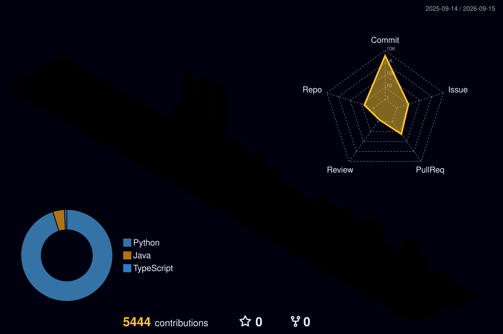

# ☁️ Haneul

<div align="center">
  
</div>

## 🎓 Introduction


<a href="https://git.io/typing-svg">
       
</a>

---

## 👨‍💻 Developer Profile: `Jeong Hyeonjin`

```python
class Developer:
    def __init__(self):
        self.major = "Materials Engineering"
        self.current = "SSAFY 15th (Samsung Software Academy for Youth)"
```

### 🎖️ Professional Experience

#### **[2026.01 - ing]** SSAFY 15th
> 개발자로서의 첫 걸음

🏆 **수상내역**
* 1학기 성적최우수(1st)
* 

🎖️ **활동내역**
* Monthly Member(1월, 3월, 8월)
* 


#### **[2021.07 - 2025.12] Math Academy | Team Leader**
> 학원 현장의 비효율을 코드로 해결
* **Academy Management System:** 구글 스프레드시트 기반 관리/평가 프로그램 기획 및 개발
* **Leadership**: 강사 및 운영팀 관리 (2023.10 - 2025.12)


#### **[2019.03 - 2021.06] ROTC 57th | Army Officer (1st Lt.)**
> 군 조직 내 업무 자동화
* **Non-Fire Training Target Automation:** 비사격 훈련 타겟 자동화 프로그램 개발(Excel) - 🏆근무 유공 표창
* **Targeting simulation:** 적 위치 입력값에 따른 표적 추천 프로그램 개발(Excel) - 🏆근무 유공 표창, 경계작전 유공 표창

---

### 🚀 Projects & Tech Milestones
* **금융특화 프로젝트**(2026.08 - ing)
    * `Role`: 팀장/백엔드
    * `Tech Stack`: Springboot, 
    * `Result`: 


* **AI모의면접 & 면접스터디 통합 플랫폼**(2026.07 - 2026.08)
    * `Role`: 프론트엔드 리더
    * `Tech Stack`: React, TypeScript, Tailwind CSS, LiveKit, WebGazer
    * `Result`: 프론트엔드 리더로서 UI 구조를 설계하고, AI 모의면접 및 실시간 화상 스터디 화면 구현

* **개인 맞춤형 부동산 서비스 개발**(2026.05 - 2026.06)
    * `Role`: Full stack
    * `Tech Stack`: Vue.js, JavaScript, Pinia, Axios, Django REST Framework, SQLite
    * `Result`: 사용자 예산과 선호 조건을 반영한 부동산 추천 및 대출 시뮬레이션 기능 구현

* **알고리즘 스터디 디스코드 봇 개발** (2026.01 - 2026.03) - Full stack
    * `Tech Stack`: Python, discord.py, Oracle Cloud Infrastructure
    * `Result`: 문제 선정과 풀이 확인을 자동화하여 일일 운영 시간을 평균 2분에서 30초로 단축
    
* **SAMSUNG SW Certificates**
    * `2026.03.06`: **SAMSUNG SW Competency Test - Grade A+ (python)** 🏆

---

### 📚 Continuous Learning (Licenses)

```json
{
  "Certified": [],
  "In_Progress": {
    "Data": ["SQLD"],
    "General": ["정보처리기사(필기 합격)"],
    "AI": ["AICE"]
  }
}
```

---

<div align="center">
  <h1>🛠 Tech Stack</h1>

  

  <h2>Familiar with...</h2>

  <a href="https://skillicons.dev">
    
  </a>

  <h2>Now studying...</h2>

  <a href="https://skillicons.dev">
    
  </a>
</div>

---

<div align="center">

  
</div>

---
## 🌌 My Grass Garden


---

## 🐍 Snake Eating My Contributions
<picture>
  <source media="(prefers-color-scheme: dark)" srcset="https://raw.githubusercontent.com/hj0543/CodeHaneul/output/github-snake-dark.svg">
  
</picture>

---

### 📫 Contact Me
<a href="mailto:hj0543@gmail.com">
  
</a>
